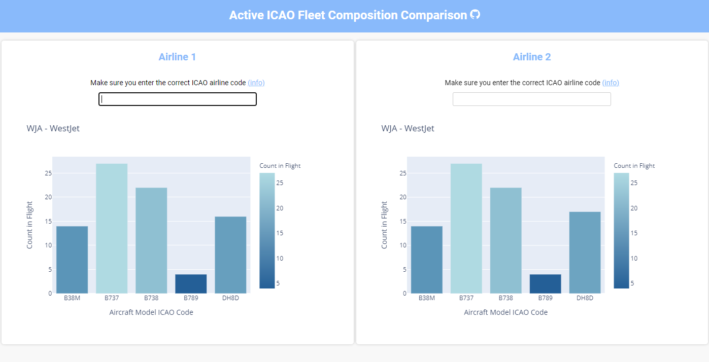

# FleetCompare
## About
This is a simple python application utilizing the [FlightRadarAPI](https://github.com/JeanExtreme002/FlightRadarAPI). The intent of building this application was for myself to learn about the deployment of python API's specifically leveraging flask while building interactive user interfaces. The end result is fairly simplistic, but displays the ease with which these python applications can be deployed.

Essentially, this application lets the user view and compare all of the "active" planes within specified airlines. Active in this sense means all of the planes which are actively within flight or on the tarmac prepared to fly/ending a flight. This may be useful to those in the aerospace maintenance industry as it allows the user to see the composition of specific fleets and the activity with which specific airplane models are being flown.

## Run Instructions
Navigate to the repository and activate the virtual environment by running the command `.env\scripts\activate`. After entering the virtual environment, run the command `pip install -r requirements.txt` to install all of the required python libararies. Now, you may start the application with `flask run`, after which, you may navigate to the localhost server being pointed to and view the application. To exit the virtual environment, run the command `deactivate`. If you need to update the requirements file, run the command `pip freeze --local > requirements.txt` within the virtual environment.

## Usage
To use the applicaiton, simply input the desired ICAO airline codes for the fleets you would like to compare. A list of these ICAO airline codes may be found at [Wikipedia](https://en.wikipedia.org/wiki/List_of_airline_codes)

## Acknowledgements
- Thank you to the creator of the FlightRadarAPI, accessing this tool to scrape flights was much easier than alternative solutions

